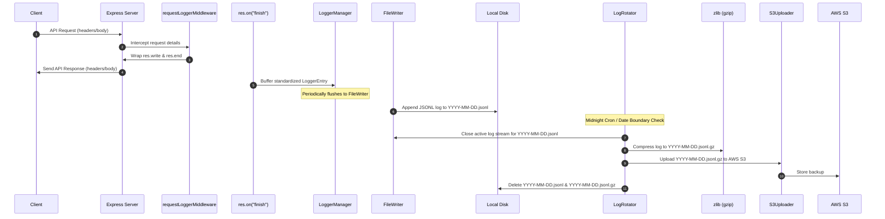

# Comprehensive Production-Grade Logging, Rotation, and S3 Backup Plan

This document defines the architecture and implementation steps to upgrade our audit logger to support request/response logging, daily log rotation, gzip compression, S3 backups, and local cleanup.

---

## Technical Design & Workflow



---

## Proposed Changes (All code files will be created in the current directory)

### 1. Project Dependencies

#### [MODIFY] [package.json](file:///home/himanshu/Documents/poc/typescript/audit_log/package.json)
- Add `@aws-sdk/client-s3` for interacting with AWS S3.
- Add `dotenv` to manage AWS environment variables safely.
- Add `node-cron` and `@types/node-cron` to schedule the midnight execution of compression and backup.

---

### 2. Standardizing Request and Response Data

#### [MODIFY] [log-entry.interface.ts](file:///home/himanshu/Documents/poc/typescript/audit_log/src/interfaces/log-entry.interface.ts)
- Extend the logging schema to capture request/response bodies and headers.
- **Properties to add:**
  - `requestBody?: any`
  - `responseBody?: any`
  - `requestHeaders?: Record<string, string>`
  - `responseHeaders?: Record<string, string>`

---

### 3. Request/Response Capture Middleware

#### [MODIFY] [request-logger.middleware.ts](file:///home/himanshu/Documents/poc/typescript/audit_log/src/middleware/request-logger.middleware.ts)
- Override `res.write` and `res.end` functions to intercept the outgoing response body buffer.
- Parse JSON request/response bodies safely.
- Standardize request/response header extraction.
- Exclude sensitive headers (e.g., `authorization`, `cookie`) and redact sensitive body keys (e.g., `password`, `token`).

---

### 4. Backup & Rotation Engine

#### [NEW] [s3-uploader.ts](file:///home/himanshu/Documents/poc/typescript/audit_log/src/logger/backup/s3-uploader.ts)
- Initialize an AWS S3 client using environment configuration.
- Implement an upload function that streams the gzip archive to S3 bucket.

#### [NEW] [log-rotator.ts](file:///home/himanshu/Documents/poc/typescript/audit_log/src/logger/manager/log-rotator.ts)
- Implement `LogRotator` logic:
  1. Determine the previous day's log file path (e.g., `request-log-YYYY-MM-DD.jsonl`).
  2. Compress it to a `.gz` archive using Node's native `zlib` stream utility.
  3. Invoke S3 uploader to transfer the `.gz` archive.
  4. Upon successful transfer, delete both the uncompressed `.jsonl` and compressed `.gz` files locally.
- Schedule this process daily at midnight using `node-cron`.

#### [NEW] [.env.example](file:///home/himanshu/Documents/poc/typescript/audit_log/.env.example)
- Define a template for environment variables:
  ```env
  PORT=3000
  AWS_ACCESS_KEY_ID=your_access_key
  AWS_SECRET_ACCESS_KEY=your_secret_key
  AWS_REGION=us-east-1
  S3_BUCKET_NAME=your-audit-logs-bucket
  ```

---

## Verification Plan

### Automated/Local Scripts
1. **Mock Test Runner**: Create `scratch/test-rotation.ts` to trigger a simulated rotation immediately rather than waiting for midnight.
2. **Verification Outputs**:
   - Confirm log structure captures request and response details.
   - Verify creation of the `.gz` file.
   - Confirm cleanup of local files after rotation.

---

## Open Questions & Decisions for Review

> [!IMPORTANT]
> 1. **PII Redaction**: Do you want us to redact specific sensitive keys from body data (like `password`, `cardNumber`, `cvv`)?
> 2. **AWS Authentication**: Is standard environment variables integration (.env) your preferred configuration method?
